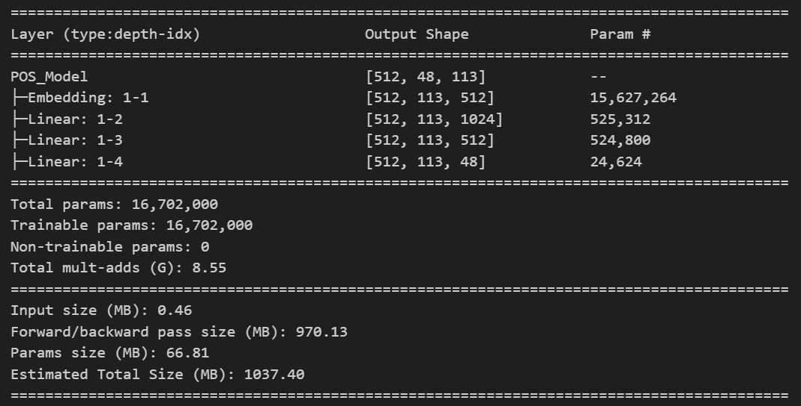
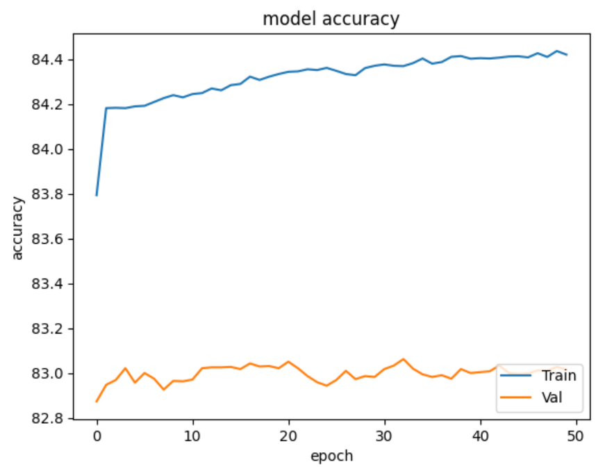
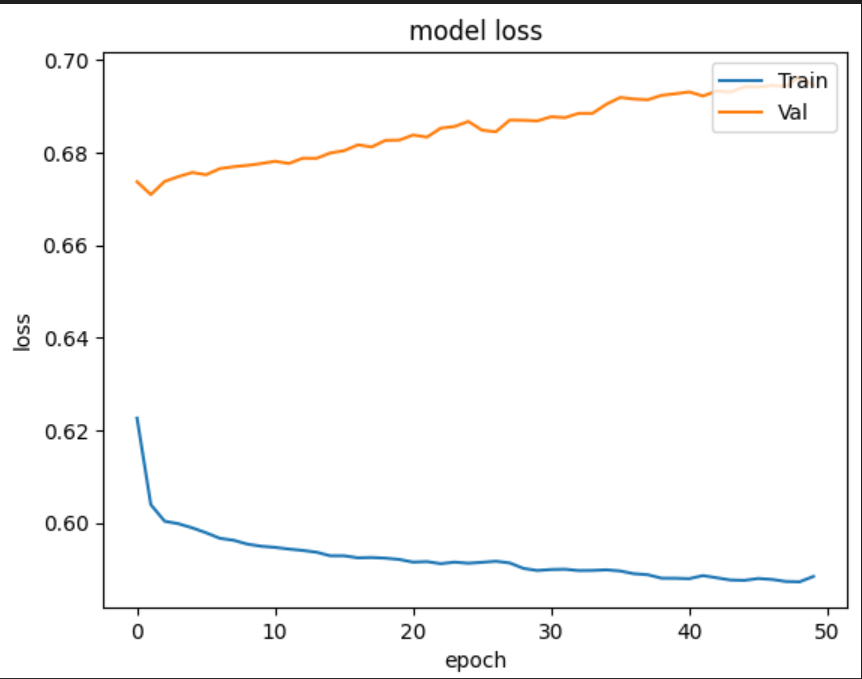

# Pos-Tagging and NER_Tagging
Pos-Tagging (Part of Speech) and NER-Tagging(Name Entity Recognition) with (CoNLL-2003) Dataset
- Dataset: Conference on Computational Natural Language Learning (CoNLL-2003)
- Pos colab: https://colab.research.google.com/drive/1mTe1XV7Ap6jwlGj6-iZes59c78ptvzjQ?usp=sharing
- Ner colab: https://colab.research.google.com/drive/1AV198F2GIWpX1fuBxXlFbp1pjwioKqbw?usp=sharing
- Model Architectures

- Model accuracy:

- Model Loss:

